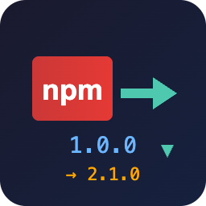
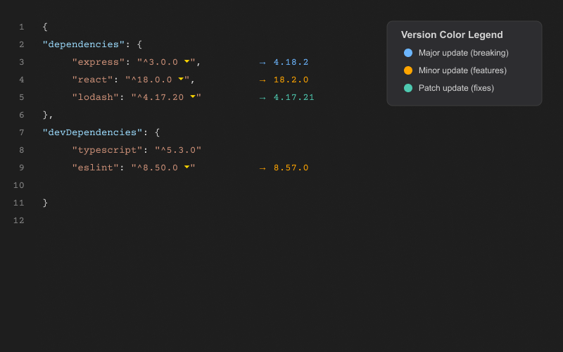
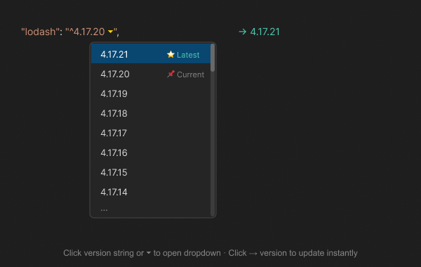

# NPM Version Dropdown in package.json

  

  <strong>Instantly see outdated npm packages and update them with a single click</strong>

  
  
  
  
  
  

---

  Made with ❤️ by Farshad Hemmati @ <a href="https://www.legalfina.com/en">Legalfina</a>

---

## ✨ Features

**NPM Version Dropdown in package.json** supercharges your `package.json` editing experience by showing you exactly which packages need updating—right where you need it.

### 🎨 Color-Coded Version Indicators

Instantly understand the scope of updates at a glance:

| Color             | Update Type | Description                                                 |
| ----------------- | ----------- | ----------------------------------------------------------- |
| 🔵 **Light Blue** | Major       | Breaking changes possible (e.g., `1.x.x` → `2.x.x`)         |
| 🟠 **Orange**     | Minor       | New features, backward compatible (e.g., `1.1.x` → `1.2.x`) |
| 🟢 **Green**      | Patch       | Bug fixes only (e.g., `1.1.1` → `1.1.2`)                    |

  

### 📋 One-Click Version Selection

Click the dropdown icon (`⏷`) next to any outdated package to see **all available versions**:

- Versions sorted from newest to oldest
- Latest stable version highlighted with ⭐
- Pre-release versions clearly marked
- Single click to replace the current version

  

### ⚡ Lightning Fast

- **Parallel fetching**: All packages are checked simultaneously
- **Smart caching**: Results are cached to avoid redundant network requests
- **Abbreviated API**: Uses npm's lightweight metadata endpoint for faster responses
- **Request deduplication**: Multiple requests for the same package share a single network call

---

## 📦 Installation

### From VS Code Marketplace

1. Open VS Code
2. Press `Ctrl+P` / `Cmd+P`
3. Type `ext install your-publisher.npm-version-lens`
4. Press Enter

### From VSIX File

1. Download the `.vsix` file from [Releases](https://github.com/your-repo/npm-version-lens/releases)
2. Open VS Code
3. Press `Ctrl+Shift+P` / `Cmd+Shift+P`
4. Type "Install from VSIX"
5. Select the downloaded file

---

## 🚀 Usage

1. **Open any `package.json` file** - The extension activates automatically
2. **View outdated packages** - Look for colored version indicators next to your dependencies
3. **Click to update** - Click anywhere on the version indicator or the `⏷` icon
4. **Select a version** - Choose from the dropdown list of all available versions

### Keyboard Shortcut

You can also trigger the version selector by placing your cursor on a version string and using the command palette:

- `Ctrl+Shift+P` / `Cmd+Shift+P` → "NPM Version Lens: Show All Versions"

---

## 🎯 Supported Sections

NPM Version Lens works with all dependency sections in your `package.json`:

- ✅ `dependencies`
- ✅ `devDependencies`
- ✅ `peerDependencies`
- ✅ `optionalDependencies`

---

## ⚙️ Commands

| Command                               | Description                                     |
| ------------------------------------- | ----------------------------------------------- |
| `NPM Version Lens: Refresh`           | Clear cache and re-fetch all package versions   |
| `NPM Version Lens: Show All Versions` | Open version dropdown for the package at cursor |

---

## 🔧 Requirements

- VS Code 1.85.0 or higher
- Internet connection (to fetch package information from npm registry)

---

## 🤔 FAQ

### Why don't I see version indicators?

- Make sure the file is named `package.json`
- Check your internet connection
- Try running "NPM Version Lens: Refresh" from the command palette

### Why is a package not showing as outdated?

- The package might already be on the latest version
- The version string might use an unsupported format (e.g., `git://`, `file:`)
- The package might not exist on the npm registry

### Can I use this with private registries?

Currently, the extension only supports the public npm registry. Private registry support is planned for a future release.

---

## 📝 Changelog

### 0.0.1 (Initial Release)

- ✨ Show latest version inline for outdated packages
- 🎨 Color-coded indicators (major/minor/patch)
- 📋 Click-to-open version dropdown
- ⚡ Parallel package fetching for speed
- 🔄 Smart caching with manual refresh option
- 📦 Support for all dependency sections

---

## 🐛 Known Issues

- Very large `package.json` files with 100+ dependencies may take a few seconds to load initially
- Scoped packages (`@org/package`) are supported but may be slightly slower to fetch

---

## 🤝 Contributing

Contributions are welcome! Please feel free to submit a Pull Request.

1. Fork the repository
2. Create your feature branch (`git checkout -b feature/AmazingFeature`)
3. Commit your changes (`git commit -m 'Add some AmazingFeature'`)
4. Push to the branch (`git push origin feature/AmazingFeature`)
5. Open a Pull Request

---

## 📄 License

This project is licensed under the MIT License - see the [LICENSE](LICENSE) file for details.

---

## 🙏 Acknowledgments

- Thanks to the npm registry for providing the package metadata API
- Thanks to <a href="https://www.legalfina.com/en">Legalfina</a> for open sourcing this project and making the extension open to the public

---

